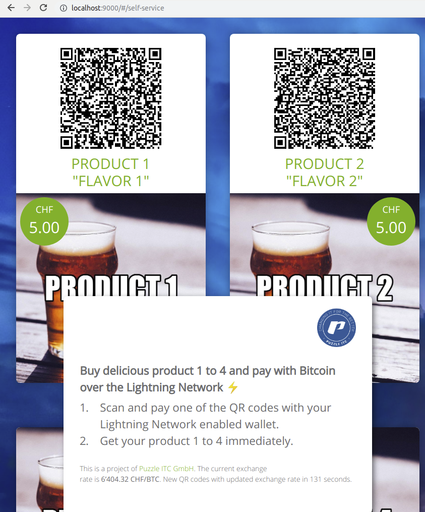

# ln-self-order-pos



This application was generated using JHipster 5.2.0, see
[README-jhipster.md](doc/README-jhipster.md) for more information on how to
start, build and run the project.

## How to use

We built this application as a template so you can build your own fancy
self-order point of sale screen.
[You can see a demo video of our version here.](https://twitter.com/gugol/status/1042658297927675905)

The following chapters will guide you through the steps that are necessary to
customize the generic `lnPos` to your needs.

### Set up your own LND node

The Spring Boot backend uses the
[LightningJ Java library](https://www.lightningj.org/) to connect to a
[Lightning Network Daemon (LND)](https://github.com/lightningnetwork/lnd) over
[gRPC](https://grpc.io/). You will need to set up an LND node with version
[`0.5.0-beta`](https://github.com/lightningnetwork/lnd/releases/tag/v0.5-beta)
or newer.

There are many tutorials out there but we recommend either 
[this (default)](https://github.com/lightningnetwork/lnd/blob/master/docs/INSTALL.md)
or
[this (docker)](https://github.com/lightningnetwork/lnd/blob/master/docs/DOCKER.md)

This application is network agnostic, so it does not matter if you are running
`testnet` or `mainnet`. But of course we strongly recommend to start with
`testnet` first!

After the LND node is running and is fully synced to the chain, follow the steps
above. We assume that LND saves its files to `~/.lnd/`. If you changed that
path, adjust the following example paths accordingly. 

* Make sure the gRPC port (default `10009`) of the node is open and reachable
* Copy the file `~/.lnd/tls.cert` to the folder `src/main/resources/certs`
* Get the hex value of the `invoice.macaroon` and store it somewhere, we'll need
  this later.  
  Use this command for example:  
  `xxd -p -c 999 ~/.lnd/data/chain/bitcoin/testnet/invoice.macaroon`
* Get the hex value of the `readonly.macaroon` and store it somewhere, we'll need
  this later.  
  Use this command for example:  
  `xxd -p -c 999 ~/.lnd/data/chain/bitcoin/testnet/readonly.macaroon`

### Configure application

Now you need to configure the application to use the LND node you just set up.

Here is an example `application-dev.yml`:

```yaml
logging:
    level:
        io.github.jhipster: DEBUG
        ch.puzzle.ln.pos: DEBUG

spring:
    profiles:
        active: dev
        include: swagger
    devtools:
        restart:
            enabled: true
        livereload:
            enabled: false # we use Webpack dev server + BrowserSync for livereload
    jackson:
        serialization.indent_output: true
    datasource:
        # See section 'Use persistent development DB' in the README to set this up
        type: com.zaxxer.hikari.HikariDataSource
        url: jdbc:postgresql://localhost:5441/ln_self_order_pos
        username: ln_self_order_pos
        password: ln_self_order_pos
    jpa:
        database-platform: io.github.jhipster.domain.util.FixedPostgreSQL82Dialect
        database: POSTGRESQL
        show-sql: false
        properties:
            hibernate.id.new_generator_mappings: true
            hibernate.cache.use_second_level_cache: false
            hibernate.cache.use_query_cache: false
            hibernate.generate_statistics: true
    liquibase:
        contexts: dev
        drop-first: true
    mail:
        host: localhost
        port: 25
        username:
        password:
    messages:
        cache-duration: PT1S # 1 second, see the ISO 8601 standard
    thymeleaf:
        cache: false

server:
    port: 8080

jhipster:
    http:
        version: V_1_1 # To use HTTP/2 you will need SSL support (see above the "server.ssl" configuration)
    cache: # Cache configuration
        ehcache: # Ehcache configuration
            time-to-live-seconds: 3600 # By default objects stay 1 hour in the cache
            max-entries: 100 # Number of objects in each cache entry
    security:
        authentication:
            jwt:
                secret: my-secret-token-to-change-in-production
    mail: # specific JHipster mail property, for standard properties see MailProperties
        base-url: http://127.0.0.1:8080
    cors:
        allowed-origins: "*"
        allowed-methods: GET, PUT, POST, DELETE, OPTIONS
        allowed-headers: "*"
        exposed-headers:
        allow-credentials: true
        max-age: 1800

application:
    bitcoin:
        # point this to /rest/chaininfo.json if you have a full node. set it
        # to 'disabled' if you don't have a bitcoind full node running.
        restUrl: disabled
    mail:
        send: true
        recipient: mail@example.com
    lnd:
        host: localhost
        port: 10009
        certPath: classpath:/certs/tls.cert
        # insert the hex values of the macaroon obtained in the previous step here!
        invoiceMacaroonHex: 0201036c.....
        readonlyMacaroonHex: 0201036c.....

```

The most important thing you need to change is to add the hex values for the
macaroons that you saved somewhere in the previous step.

### Write your own invoice processor

Invoice processors are invoked after a Lightning Network invoice has been
updated. Usually, this means it has been paid/settled. You can write your
own invoice processor by implementing `ApplicationListener<InvoiceEvent>` in 
your service.

There is an example `ch.puzzle.ln.pos.service.processors.MailSendOrderProcessor`
service that sends out an e-mail whenever an invoice has been paid:

```java
package ch.puzzle.ln.pos.service.processors;

import ch.puzzle.ln.pos.service.InvoiceEvent;
import ch.puzzle.ln.pos.service.MailService;
import ch.puzzle.ln.pos.service.dto.InvoiceDTO;
import org.springframework.context.ApplicationListener;
import org.springframework.stereotype.Service;

@Service
public class MailSendOrderProcessor implements ApplicationListener<InvoiceEvent> {

    private final MailService mailService;

    public MailSendOrderProcessor(MailService mailService) {
        this.mailService = mailService;
    }

    @Override
    public void onApplicationEvent(InvoiceEvent event) {
        InvoiceDTO invoice = event.getInvoice();
        
        // Make sure we only send an e-mail if the invoice has been settled
        // for the first time.
        if (invoice.isSettled() && event.isFirstSettleEvent()) {
            mailService.sendOrderConfirmation(invoice);
        }
    }
}

```

You can customize this however you want.

### Build your own web GUI

There is a simple generic example self-order store implemented in the web GUI.

To change the products and their price, make sure to edit the following files:

* `src/main/java/ch/puzzle/ln/pos/domain/enums/OrderItemType.java`
* `src/main/webapp/app/shared/model/invoice.model.ts`
* `src/main/webapp/app/shared/model/product.model.ts`

To change the way the self-order store looks, edit the following files:

* `src/main/webapp/app/shop/self-service.component.html`
* `src/main/webapp/app/shop/self-service.component.scss`

## Misc

### Admin GUI

There is a whole admin area available if you change the URL from
`/#/self-service` to `/#/admin`. The default username is `admin` and the
password is `admin`.

Apart from the default jHipster management tools like user management, metrics,
health, configuration, audits, logs and API you also have an overview of
your invoices and a page that displays the status of your LND node.

### Use persistent development DB

```bash
docker run \
  -d \
  -e POSTGRESQL_USER=ln_self_order_pos \
  -e POSTGRESQL_PASSWORD=ln_self_order_pos \
  -e POSTGRESQL_DATABASE=ln_self_order_pos \
  -p 5441:5432 \
  --name ln-self-order-pos-db \
  --restart unless-stopped \
  centos/postgresql-96-centos7

```

